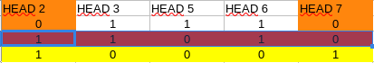
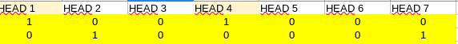

# Dancing Links

Dancing Links is an algorithm to solve the exact coverage problem. The exact cover problem is defined as follows: given a subset S of the set X, the exact cover is a subset of S called S' where the elements of X are contained only once.

Sudoku can be understood as an exact cover problem, because for each possibility in each square, it is only possible, applying the appropriate restrictions, to find a single result.

Therefore, it is possible to design a DLX (Dancing Links) algorithm that solves sudoku.

The DLX algorithm is designed as a doubly linked list, (actually four times linked). In other words, each node is linked to its successor, predecessor, the one above and the one below.
This way, when a node is removed because it does not satisfy the conditions, it stores all the information about its connections, so if we want to reinsert that node into the main list, we will use the data contained within it to recreate the list.

Each column has a head that connects to other heads (laterally) and to the first and last node in the column. This control head is the basis of the algorithm, as it is where we store information such as the size of the column and the value of the column elements.

When a column node is chosen, the column is removed from the list, as well as all other columns that are linked laterally to that node.

## Example :

Given a matrix it is necessary to find the row combination where there is only one 1 for each column


We take the first column and choose the first 1 available.


Then we select the entire row.


So we select all columns that contain 1


Now we check if there are other rows that contain 1 within the selected columns and remove these rows too


we add the selected row to the partial result.


And we recreate the matrix with the values ​​that were not removed.


We repeat the procedure until there are no columns and the partial result contains 1s in all columns. If it does not satisfy the conditions, we go back and select another node.


Partial result


In this case, we do not have columns with nodes to choose from and the result does not contain 1s in all columns, so we go back to the previous step and select another node.


Partial result


Since we chose all possible lines in the previous step, we go back two steps and choose a new one in the.


Related row selection.


Partial result.


New matrix


Partial result


Column 5 is empty so we go back one step and select the new node




Partial result



New Matrix


Partial result


Now all columns have only one 1 and therefore we arrive at our final result.

## Sudoku Dancing Links

To use the Dancing Links algorithm to solve soduku it is necessary to create a generic binary matrix that satisfies all the game's constraints, that is, that no number is repeated in the row, column or zone.


It is possible to access the binary table of possibilities in the file binary_sudoku_table_4x4 in the sudoku folder.

This table shows the relationship between all possibilities, so when we select the value 1 for the square in zone 1, in row 1 and in column 1, all 1s in the row, column and zone are removed. This way it is possible to apply the Dancing Links algorithm to solve sudoku.
It is important to highlight that the values ​​in each square are actually stored at the head of the column and would actually be represented as 1s as in the previous example.

## Pseudo Code

1. Doubly linked list's construction

To create the doubly linked list it is necessary to have a data structure that represents the nodes.

N is equal to base*base, if the base is 3, so N is equal to 9 and the board will be 9x9.

Node structure :

```
Node
    int name
    int size
    node rightNode
    node leftNode
    node upNode
    node downNode
    node columnHead
```

```
createLinkedList

    // creates an auxiliary table with the nodes that will be used to create the list

    Node[][] nodeTable <- Node[n³][4n²]

    //ColumnHead root

    Node columnHeadRoot

    for int line <- 0, until line equal n³, line++
        int row <- line % n²
        int column <- line % n + (n * (line/n²))
        
        if( line % n + line /n² >= n)
            value <- line % n² + ((line/n²) -n)
        else
            value <- line % n² + (line/n²)

        int tempZone <- ((row / n) / base) * base + (column % n) / base
        int zone <- value % n + (tempZone * n)

        nodeTable[line][row] <- new Node()
        nodeTable[line][column + size²] <- new Node()
        nodeTable[line][value + 2 * size²] <- new Node()
        nodeTable[line][zone + 3 * size²] <- new Node()
    
    // it creates the head of each column 

    for int head <- 0, until head equals 4n², head ++
        new Node() columnHead
        set columnHead.name <- head
        set columnHead.size <- n

        if head equals to zero
            columnHeadRoot <- columnHead
            columnHead.rightNode <- columnHead
            columnHead.leftNode <- columnHead
            columnHead.upNode <- columnHead
            columnHead.downNode <- columnHead
        else
            columnHead.rightNode <- columnHeadRoot
            columnHead.leftNode <- columnHeadRoot.leftNode
            columnHeadRoot.leftNode.rightNode <- columnHead
            columnHeadRoot.leftNode <- columnHead
            columnHead.upNode <- columnHead
            columnHead.downNode <- columnHead
        
        //connects the nodes at the top and bottom and with the head

        for int row <- 0, until row equals n³, row ++
            if(nodeTable[row][head] instance off Node)
                nodeTable[row][head].head <- columnHead
                nodeTable[row][head].upNode <- columnHead.upNode
                nodeTable[row][head].downNode <- columnHead
                columnHead.upNode.downNode <- nodeTable[row][head]
                columnHead.upNode <- nodeTable[row][head]
    
    // Connect the nodes on the right and left

    for int row <- 0, until row equals n³, row ++
        Node rootNode <- null
        for int column <- 0, until column equals n³, column ++
            if nodeTable[row][column] not equal null
                if rootNode equal null
                    rootNode <- nodeTable[row][column]
                    rootNode.rigntNode <- rootNode
                    rootNode.leftNode <- rootNode
                else
                    nodeTable[row][column].rightNode <- rootNode
                    nodeTable[row][column].leftNode <- rootNode.leftNode 
                    rootNode.leftNode.rightNode <- nodeTable[row][column]
                    rootNode.leftNode <- nodeTable[row][column]


```

2. Fist insertion

It insert the first numbers to create the initial sudoku table.

This algorithm receives a sudoku board where empty values ​​are represented by zero. As soon as the algorithm finds a non-zero value, it needs to identify which possibility in the binary table this value corresponds to and remove the corresponding rows and columns from the binary table. This algorithm makes use of the cover method, implemented in Donald Knuth's dancing links algorithm

all nodes that are removed from the list are added to the results list.

```
findRow(Node node)
    return node.head.name / n
```

```
findColumn(Node node)
    return node.head.name % n
```

```
findValue(Node node)
    return (node.head.name % n) + 1
```

```
cover(Node columnHead)
    if(columnHead equal columnHeadRoot)
        columnHeadRoot <- columnHeadRoot.rightNode
    
    columnHead.leftNode.rightNode <- columnHead.rightNode
    columnHead.rightNode.leftNode <- columnHead.leftNode

    Node node <- columnHead.downNode
    while columnHead not equal node
        node controlNode <- node.rightNode

        while controlNode not equal node
            controlNode.upNode.downNode <- controlNode.downNode
            controlNode.downNode.upNode <- controlNode.upNode
            controlNode.head.size <- controlNode.head.size - 1
            controNode <- controlNode.rightNode

        node <- node.downNode
```

```
firstInsertion(int[][] board, Node[] result, Node columnHeadRoot)
    for int row <- 0, until row equal n, row ++
        for int column <- 0, until column equal n, column +++
            if board[row][column] not equals zero
                int verify <- result.size + 1
                Node columnHead <- columnHeadRoot
                while verify not equal result.size
                    if findLine(columnHead.downNode) equal row
                        Node node <- columnHead.downNode
                        if findColumn(node.rightNode) equal column
                            do
                                if findValue(node.rightNode.rightNode) equals board[row][column]
                                    Node insertColumnHead <- node.head
                                    cover(insertColumnHead)
                                    result.add <- node
                                    
                                    Node controlNode <- node.rightNode
                                    while controleNode not equals Node
                                        cover(node.head)
                                        controlNode <- controlNode.rightNode
                                    break;
                                node <- node.downNode
                            while node not equal columnHead
                    columnHead <- columnHead.rightNode
```

3. Dancing Links Algorithm

```
cover(Node columnHead)
    if(columnHead equal columnHeadRoot)
        columnHeadRoot <- columnHeadRoot.rightNode
    
    columnHead.leftNode.rightNode <- columnHead.rightNode
    columnHead.rightNode.leftNode <- columnHead.leftNode

    Node node <- columnHead.downNode
    while columnHead not equal node
        node controlNode <- node.rightNode

        while controlNode not equal node
            controlNode.upNode.downNode <- controlNode.downNode
            controlNode.downNode.upNode <- controlNode.upNode
            controlNode.head.size <- controlNode.head.size - 1
            controNode <- controlNode.rightNode

        node <- node.downNode
```

```
uncover(Node columnHead)
    Node node <- columnHead.upNode
    while columnHead not equal node
        Node controlNode <- node.leftNode
        while controlNode not equal node
            controlNode.head.size <- control.head.size + 1
            controlNode.upNode.downNode <- controlNode
            controlNode.downNode.upNode <- controlNode
            controNode <- controlNode.leftNode
        node <- node.upNode
    columnHead.leftNode.rightNode <- columnHead
    columnHead.rightNode.leftNode <- columnHead
```

```
findLowestSize()
    Node auxColumnHead = columnHeadRoot
    Node choseOne = auxColumnHead
    do
        if auxColumnHead.size < choseOne.size
            choseOne <- auxColumnHead
        if auxColumnHead.size equal 1
            break
        auxColumnHead <- auxColumnHead.rightNode
    while auxColumn not equal columnHeadRoot
    return choseOne
```

```
search()
    if columnHeadRoot not equal columnHeadRoot.rightNode
        Node columnHead = findLowestSize()
        cover(columnHead)
        Node node <- columnHead.downNode
        while node not equal columnHead
            result.add <- node
            Node controlNode <- node.rightNode
            while node not equal controlNode
                cover(controlNode.head)
                controlNode <- controlNode.rightNode
            if search is true
                return true
            else
                result.remove <- node
                controlNode = node.leftNode
                while controlNode not equal node
                    uncover(controlNode.head)
                    controlNode <- controlNode.leftNode
                node <- node.downNode
        uncover(columnHead)
        return false
    return true
```

## Complexity Algorithm

