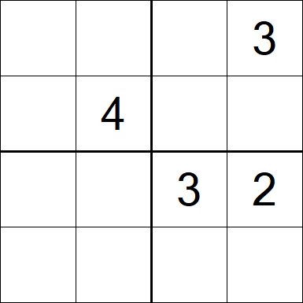

# Sudoku solver

1. Sudoku Game
2. Test Machine configuration
3. Performance test method
4. Cases
    1. Backtracking
    2. Grap Coloring with Backtracking
    3. Dancing Links
    4. Dancing Links non-recursive
    5. Dancing Linls Parallel

In this repository there are basically three algorithms and some hybrid implementations. They are:

* Backtracking
* Graph Coloring with Backtracking
* Dancing Links

## 1. Sudoku Game

The Sudoku game is normally played on a 9x9 board, but for the purpose of simplifying tests and explanations, a 4x4 board will always be used.
All the algorithms implemented here can be used on boards that are the exact power of some number, for example, in base 2 we have the 4x4 board, in base 3 the 9x9 board, in base 4 the 16x16 board and so on.

4x4 board example:

Sudoku has 4 simple rules: No number can be repeated in the row, nor in the column, nor in the 2x2 zones in the case of the 4x4 board and each square can only have a single number.
In this case, in line 3 column 2 it is only possible to place the number 1, as line 3 already has the numbers 2 and 3 and column 2 already has the number 4.

## 2. Test machine configuration

Motherboard - MSI B550-A PRO

CPU - AMD Ryzen 5600G (3,9Ghz)

RAM - 32Go (2x16Go) DDR4 3200MT

## 3. Performance test method

The code execution speed is measured only when executing the method that searches for the sudoku answer through the System.currentTimeMillis function.
There are a hundred boards for each case, and for level 3 and 4 (9x9 and 16x16 boards respectively) there are boards with as few clues as possible so that there is only one answer. At level 3 there are 17 clues and at level 4 there are 55.

## 4.1 Backtracking

Is a simple algorithm that checks all possibilities for a given table. However, before choosing a possibility, it checks whether it is possible to insert that number in the desired position. If possible, it makes this choice, and in the future, if the choice proves to be wrong, the algorithm can choose the next number until it manages to find a solution or goes through all the probabilities and therefore proves that the sudoku is unsolvable.

Performance test

    Average

| Sudoku Size |  Time (S)  |
|-------------|------------|
|     4X4     |  0.000025  |
|     9X9     |  0.002114  |
|    16x16    |  0.203513  |
|    25x25    |  21.611405 |